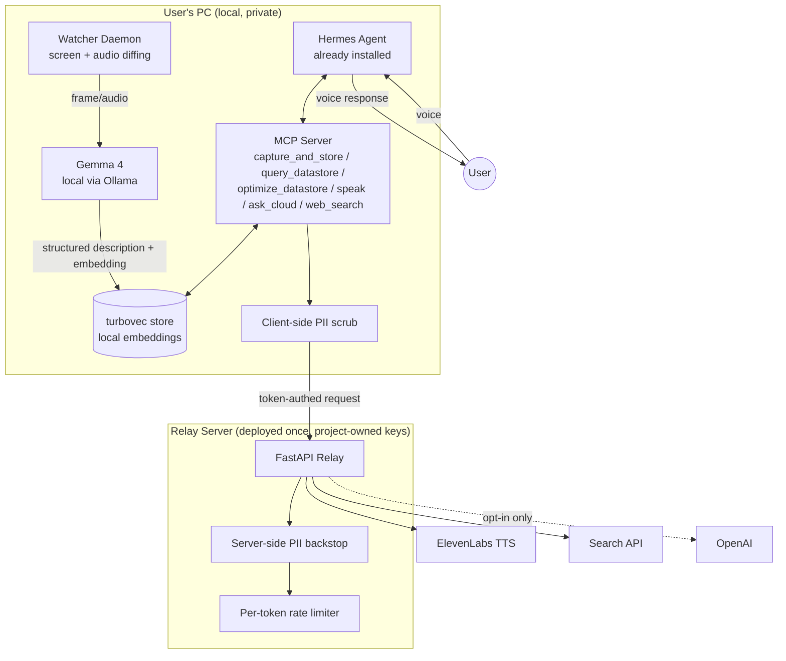

# PRD: Local-First Proactive Multimodal Assistant (working title)

## 1. Summary
A local-first desktop assistant that continuously observes what a user is doing on their PC (screen + audio), builds a private, on-device knowledge store of that activity, and uses an existing Hermes Agent install to answer voice questions and proactively surface useful information — without requiring the user to bring their own API keys for the cloud-dependent pieces.

## 2. Problem
Existing AI assistants are either (a) fully cloud-based, sending everything off-device, or (b) fully local but passive — they only respond when asked and have no persistent understanding of ongoing context. Setting up a local multimodal pipeline today also requires users to source and manage multiple API keys (TTS, search, cloud LLM), which kills adoption for a hackathon-scale audience.

## 3. Goals
- Local-first capture and understanding of screen + audio activity, stored privately on-device
- Reactive voice Q&A grounded in both the local store and live web search
- Proactive, gated interjection when something on-screen is worth surfacing
- Zero-API-key onboarding: install script + shared relay server handles TTS, web search, and optional cloud LLM escalation
- Ship as a single install script on top of an existing Hermes Agent installation (not a bundled monolith)

## 4. Non-Goals
- Not building a new agent framework — this rides entirely on top of Hermes Agent
- Not supporting mobile in v1
- Not building account/auth system beyond a lightweight per-device token
- Not aiming for production-grade PII detection — best-effort scrub, clearly disclosed

## 5. Users
Hackathon judges / early testers: technical users comfortable installing dev tools, running a script, and granting screen/mic permissions. Not a general consumer launch.

## 6. Key Features

| # | Feature | Description |
|---|---|---|
| 1 | Screen/audio watcher | Local daemon, periodic diffed capture, feeds Gemma 4 |
| 2 | Local multimodal understanding | Gemma 4 (E4B/12B) via Ollama, runs fully on-device |
| 3 | Local vector store | turbovec-backed store of activity summaries + embeddings |
| 4 | Datastore optimization | Periodic dedup/prune job run by Hermes |
| 5 | Voice Q&A | User asks aloud → Hermes queries local store + web search → answers via TTS |
| 6 | Proactive interjection | Gated heuristic decides when to speak up unprompted |
| 7 | Shared relay server | Proxies ElevenLabs (TTS), search API, and OpenAI (opt-in) using project-owned keys |
| 8 | PII scrubbing | Client-side scrub before any network call, server-side backstop at relay |
| 9 | Cloud escalation (opt-in) | `ask_cloud` tool, off by default, text-only, never raw screen/audio |

## 7. Architecture

**Flow, in words:**
1. Watcher captures screen/audio locally, diffs against last frame, skips if nothing changed
2. On meaningful change, Gemma 4 (local) produces a structured description
3. Description + embedding written to turbovec
4. Hermes, via the MCP server, can query that store for Q&A or decide to proactively speak
5. Anything that needs to leave the device (TTS, web search, optional cloud LLM) goes through the local PII scrub, then to the relay server using a device token — never a personal API key
6. Relay applies a second PII pass, rate-limits per device, and forwards to the real provider using project-owned keys

## 8. Tech Stack
- **Local model**: Gemma 4 E4B or 12B Unified, served via Ollama
- **Vector store**: turbovec (Rust/Python, TurboQuant-based, in-process, no server)
- **Agent**: Hermes Agent (Nous Research, user-installed, MIT licensed) — skill + MCP server extend it
- **Voice**: ElevenLabs TTS, proxied through relay
- **Search**: Tavily/Serper, proxied through relay
- **Cloud escalation**: OpenAI, proxied through relay, opt-in, text-only
- **Relay server**: FastAPI, deployed on Railway/Fly.io, Dockerized
- **Install**: shell/PowerShell script — installs Ollama, pulls Gemma 4, installs turbovec, registers device token, drops skill + MCP config into Hermes

## 9. Privacy & Consent
- Screen/mic capture requires explicit OS-level permission grant
- Raw screen/audio never leaves the device under any circumstance
- Only distilled text summaries can be sent to the relay, and only for TTS/search/opt-in cloud escalation
- Cloud escalation (`ask_cloud`) is off by default, toggled during install, clearly labeled
- Device token identifies the install, not the person — no account system in v1

## 10. Success Metrics (hackathon scope)
- Time from `install.sh` to first working voice Q&A: **under 5 minutes**
- Proactive interjection triggers correctly on at least one clear scripted demo scenario, and stays silent during a "boring" control scenario
- Zero personal API keys required at any point in setup
- Relay server handles the full demo session without hitting rate limits

## 11. Risks
| Risk | Mitigation |
|---|---|
| Proactive gate too noisy/annoying | Keep heuristic simple and conservative for v1; hardcoded rules over ML |
| Relay costs spike if shared publicly | Per-device rate limiting, keys never touch client |
| Local model too slow on judge's laptop | Default to E4B, document 12B as optional upgrade |
| PII scrub misses something | Two-layer scrub + explicit consent framing, not marketed as guaranteed |

## 12. Out of Scope for v1 / Future Work
- User accounts and per-user billing on the relay
- Mobile companion app
- Multi-device sync of the local store
- Fine-tuned proactivity model (replace heuristic gate)
